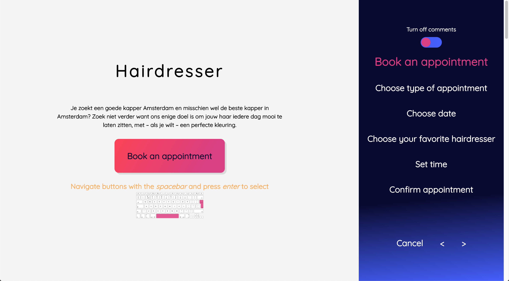
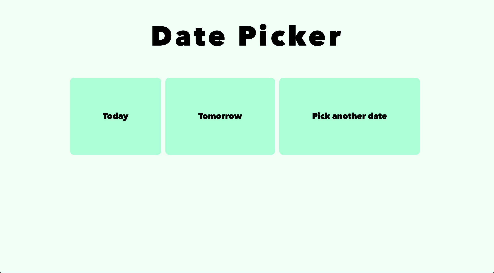
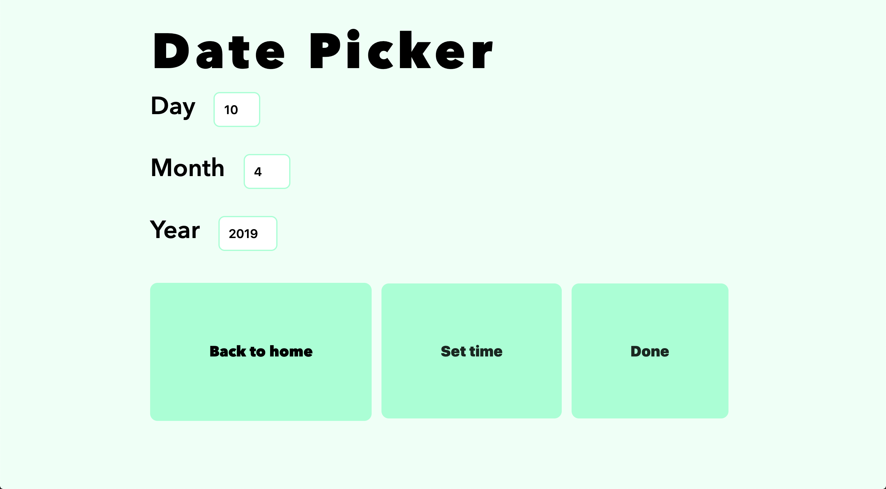
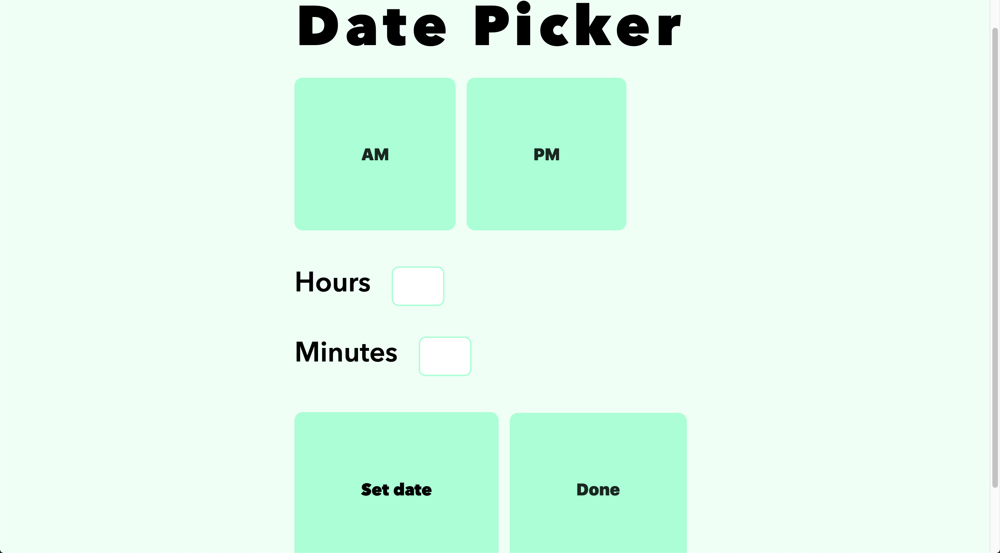
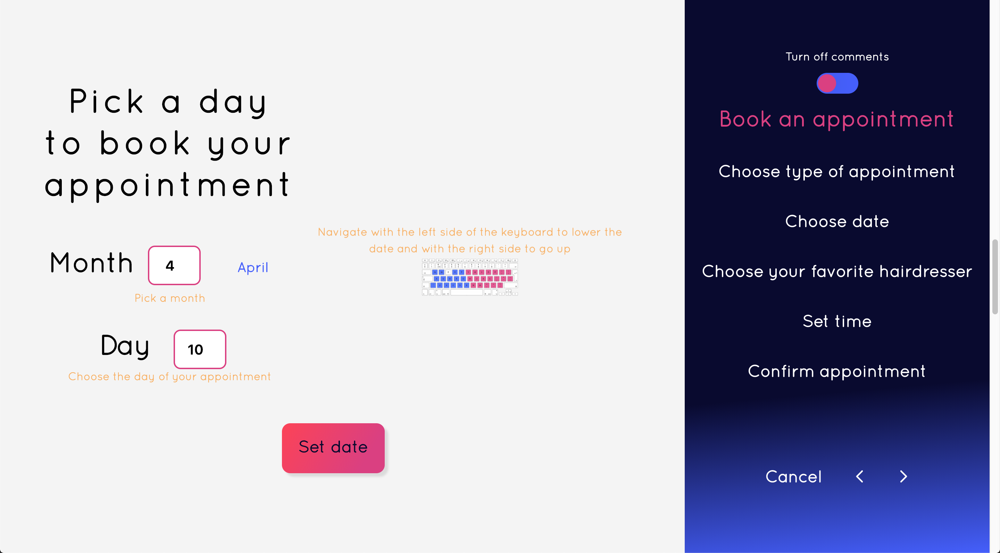
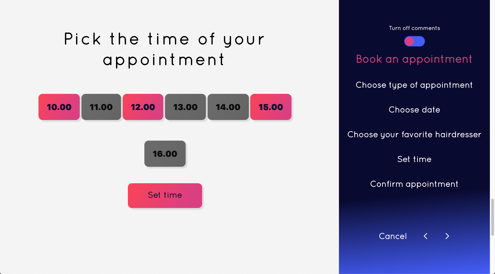
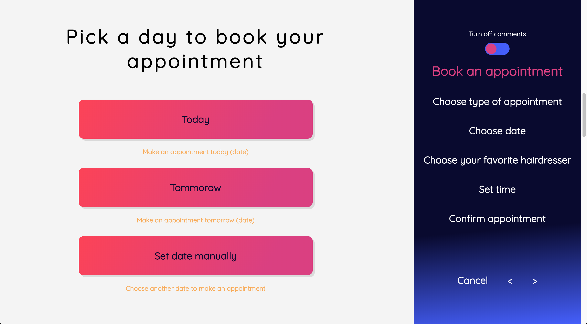
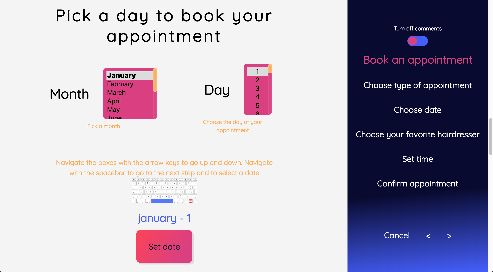
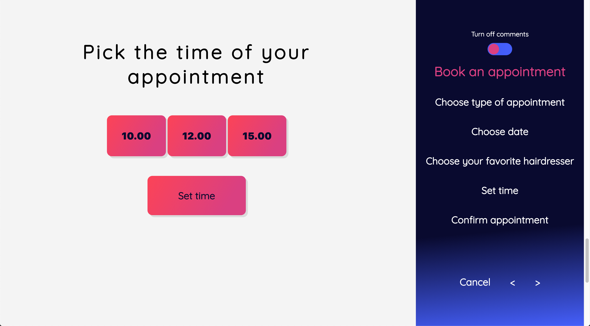

# Web Design | 

**Improve an certain feature of a webpage, that might be difficult for Marijn to use. Marijn is motor impaired and has some difficulty navigating small features on webpages. In this course I decided to improve a datepicker for Marijn and keep the following in mind:**

* **Study situation**
* **Ignore Conventions**
* **Prioritise Identity**
* **Add nonsense**



## Table of Contents
* **[How to install](#how-to-install)**
* **[How to use](#how-to-use)**
* **[User scenario](#user-scenario)**
* **[User interface design principles](#user-interface-design-principles)**
* **[Feedback](#feedback)**
* **[Resources](#resources)**
* **[License](#license)**

## How to install

Before installing make sure you have installed node.js and npm.
Choose or make a new directory.
Load the template into your directory.

```bash
git clone https://github.com/chelseadoeleman/web-design-1819.git
```

Make sure you are in the right directory 
```bash
cd web-design-1819
```

Check if you have the latest version of npm.
Install the dependencies in [package.json](./package.json)
```bash
npm install
```

## How to use


## User scenario

Marijn works as a developer. But has a handicap called being physically motor impaired which causes tremors and muscle rigidity. He works always with a macbook pro and uses sticky keys to help him navigate the keyboard. He is can only navigate the keyboard with his left hand. Especially fine motor skills are a difficulty for Marijn, so lifting his hand takes up a lot of energy. Because all his muscles are affected he sometimes has trouble with speech which doesn’t make him always comprehendible.

In two days Marijn has a wedding he has to attend to, naturally he would like to look his best. To achieve this chique look he would like to have his hair done differently before the wedding. 
The best day to do this is on the day of the big event, because then it would look its best. Luckily Marijns hairdresser has the option to book an appointment online. Because Marijn is at work he wants to do this quickly so he can resume his daily tasks. Marijn can only use his left hand and still not at its full extent because he suffers from tremors and muscle rigidity. 

When opening the website Marijn is able to navigate the site quite easily with his left hand, even when pressing a wrong key. Because he wants to change something he has done before he uses a key as a sticky key to navigate backwards. The interface is clear because it has been broken down into steps. In the end Marijn is able to fix any mistakes he made in the earlier steps. When he gets interrupted during work he is still able to resume his task where he left off. Luckily the hair salon has one place left on that specific day in the morning with Marijns favorite hairdresser. Marijn has booked an appointment successfully and can now go back to work.

## User Interface Design Principles

* 1. You are able to book a hairdressers appointment, make this your #1 priority to make this clear for your user. Be kinda predictable, but ignore conventions.

* 4. Keep status and let users be in control of their flow. Give feedback on what will happen next.

* 6. Give the user one input action. Like setting a date or choosing what kind of appointment.

* 9. Items should look how they behave. **! Beware of conventions**. 

* 11. / 
    12.  What is the most important step in your application? : Setting date, time and appointment info. Break it down to   the essentials to defer cognitive load. 

* 14. Divide actions into different steps. Like booking an appointment at the hair dresser.

* 16. Give the user information about certain aspects/ features the user can do. Give them the possibility to turn this feature off (e.g. finder)

## Feedback

<details>  
    <summary>Week 1</summary>

This is my first version of a datepicker where I divided a datepicker into multiple steps with **BIG** buttons to match. I did so that the user can easily make mistakes and come back to that element to improve his answer. I also made an feature where the user is able to fill in the date input with his whole keyboard. So the right side is made to increase the value and the left side to decrease. I also found that focus styles are very important, so the user is able to see where he is in the page.







## Feedback

**NOTE** Some of the feedback is actually notated in Dutch and has to be updated to English.

**Own feedback**
*   Give some sort of explanation for certain feature, that the user might not understand. For example the **finder** interface on Mac OS. Where the user is able to make his own navigation and how much explantion they would like at certain icons.
* The datepicker is a very usefull user case for Marijn, so try to itterate on this. Think of a concept around it.

**Things to know about Marijn**

Unfortunately Marijn wasn't able to make it the first week, but luckily we could ask Vasilis some questions about Marijn

* Macbook pro
* Sticky keys
* Gebruikt maar 1 hand (linker)
* Moeite met fijne motoriek
* Optillen van hand is moeilijk
* Eye tracking is een gaaf idee
* Add nonsense -> Test veel
* Moeilijk om te verstaan dus spraak gestuurd is niet handig  -> vragen of het volgens hem eventueel wel kan.
* Aan de hand van emoties of bepaalde geluiden kan Marijn dingen wel duidelijk maken, tijdens het testen.

* Spastisch -> gespannen spieren
* Date picker itereren

* Gebruikt de spatiebalk om te scrollen

* Maakt gebruik van access keys? - Niet zeker
* Hoe navigeer je door priegelige linkjes?

* Doet alles met het toetsenbord
* Bouw meerdere kleine features die nuttig kunnen zijn en maak iteraties
* Maak een hele pagina accessible?

</details>

<details>  
    <summary>Week 2</summary>

For my concept I came up with making an appointment at the hairdresser, because this seemed like a basic thing Marijn will probably do, whether he has a hairdresser at home or he goes to visit one.
I still divided the whole process into multiple steps and made a progressbar on the side where he can track his position when navigating the page. To see how many steps he has to accomplish before he has an appointment.

He is also able to use the spacebar to navigate the page instead of just tab, to make certain elements focussable. I also kept in the feature of dividing the keyboard into two section to increase and decrease the value of the input fields, where he has to fill in the date. 

[Online application](https://datepicker-v2.netlify.com)

Here are some elements of the page that are the most important.




On this page you can see some sort of explanation how the user is able to navigate some certain features. The user is also able to turn this off, when things are clear enough.



This week we actually got to test with Marijn. 
**NOTE** The feedback is actually notated in Dutch and has to be updated to English.

## Feedback

- Navigeert niet met tab, maar meestal met de spatiebalk of trackpad.
- Tab werkt niet lekker in safari.
- Pijltjes toetsen ‘H’ ‘J’ ‘K’ ’L’ om te navigeren, beter dan 'A' 'S' 'D' 'W'.
- Gebruikt liever pijltjes toetsen voor een drag & drop
- Iets doen met programmeer taal - want Marijn is een developer.
- Let op case sensitivity (CAPS LOCK) toLowerCase( ).
- Zo min mogelijk intikken - geen spaties, komma’s, punten, etc.
- Maak onderdelen die niet over het hele scherm verspreid zijn, want dan moet Marijn ver navigeren.
- Native form controls werken vaak goed - nog meer optimaliseren.
- Vergeet niet te stress testen - te hoge waardes invullen.
- Bij een geboortedatum is een dropdown niet handig.
- Geboorte jaar interessante use case.
- Gebruikt de touch bar om terug te gaan.

**Eigen feedback tijdens de observatie**
- Spatiebalk is prima om te navigeren.
- Input velden zijn niet altijd even goed, aangezien er meerdere getallen ingevoerd kunnen worden.
- Gebruikt soms ook zijn trackpad.
- Knoppen die dichter bij elkaar staan zijn fijner, zorg dan wel voor een groter raakvlak.
- Wil soms ook gebruik maken van de pijltjes toetsen, liever dan het opdelen van het toetsenbord in twee delen.

**Verbeter punten**
- Input kan niet juist ingevoerd worden
- Navigeren gaat moeizaam misschien de sidebar aan de zijkant weghalen? Of onderaan de pagina zetten, zodat hij gelijk kan beginnen met navigeren in plaats van vast zitten in de navigatie van de sidebar.
- Uitleg groter maken.
- Tikt vaak 2 toetsen tegelijk in - andere toetsen uitzetten?
- Laat zien wat de datum is.
- Maakt gebruik van safari als browser ipv chrome.


</details>


<details>  
    <summary>Week 3</summary>

This week I solely focused on making the buttons bigger, so that Marijn is also able to use his trackpad to navigate through the application and adding hover styles that were previously only focus styles, because I thought he would only use his keyboard. 

The I tried to make an dropdown where he will be able to use the right side to of the keyboard to go up in the dropdown and left side to go down. However I found that native form controls are pretty hard to manipulate. Also you would lose the feature where you are able to type in an letter that navigates directly to words with that letter. So in the end I decided to skip this, only the test will prove whether this was a good decision.

[Online application](https://datepicker-v3.netlify.com)







This week we had a second testing session with Marijn.
**NOTE** The feedback is actually notated in Dutch and has to be updated to English.

## Feedback

**Observaties**
* Aanwijzing geven hoe dingen werken en waar dingen te vinden zijn in de applicatie is handig.

* Liever geen dubbele keys
* Basis logica voor toetsenbord geen > maar . - houd de standaard layout aan van QWERTY.
* Focus door laten gaan vanaf een dropdown naar een volgend dropdown item na het invullen is handig.

* Gebruik maken van sticky keys om te switchen tussen input velden.
* Ziet snel bugs in de code en houd van stress testen.
* Gebruikt zijn duim om het touchpad te besturen, vingers zijn gestrekt

*  Joystick kan goed bestuurd worden, maar is wel bewerkelijk vanwege de gevoeligheid hiervan - snelheid lager?

* Gebruikt graag enter, wanneer hij gebruik maakt van de pijltjes toetsen. Maar bij het gebruik van
WASD als pijltjes toetsen, dan gebruikt hij liever tab als enter toets.
Toetsen die dicht bij elkaar liggen zijn chill.

* Vindt snel edge cases


**Eigen Feeback**
* Knoppen zijn groot genoeg.
* Datum invullen ging gemakkelijk, gebruikt inderdaad het keyboard om snel door de dropdown te navigeren door het invullen van het eerste cijfer of letter.
* Dropdowns werken beter dan input velden, omdat de waardes hiervan moeilijk te bewerken zijn wanneer je per ongeluk iets anders in toetst.
* Stap voor stap navigeren werkt ook goed.


**Nieuwe concept ideeën ADD NONSENSE**

Helaas ben ik hier niet meer aan toegekomen, maar had de volgende features er graag nog in willen verwerken.

* Voeg geluiden toe wanneer de focus per ongeluk verloren gaat zodat de gebruiker weet dat hij de focus er opnieuw op moet zetten (hoofdbewegingen zorgen ervoor dat er soms iets op het scherm niet gezien wordt)

* Makkelijk kunnen switchen van trackpad naar toetsenbord, dus ga door naar de volgende focus style met het keyboard op de plek waar je gebleven bent op die pagina. Detecteer dus je locatie van de gebruiker op een pagina en ga naar de dichtsbijzijnde focus style. Dit voorkomt dat de gebruiker weer vanaf bovenaan moet beginnen met het navigeren van de paigna.

* Elke keer als je naast een button klikt met een bepaald margin deze steeds groter maken en dan weer terug veranderen naar de oude grootte
    

</details>


## Resources

* [npm](https://docs.npmjs.com/cli/run-script)
* [markdown](https://guides.github.com/features/mastering-markdown/)
* [Ejs](https://ejs.co/)
* [Nodemon](https://nodemon.io/)
* [Express](https://expressjs.com/)
* [Node](https://nodejs.org/en/)
* [Helmet](https://github.com/helmetjs/helmet)
* [Node-fetch](https://www.npmjs.com/package/node-fetch)

## License
This repository is licensed as [MIT](LICENSE) by [Chelsea Doeleman](https://github.com/chelseadoeleman).
